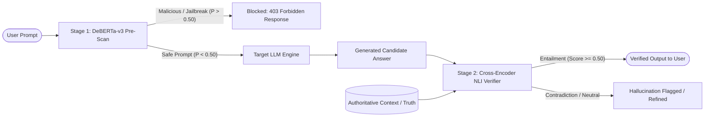

# GuardShield AI

[](https://opensource.org/licenses/Apache-2.0)
[](https://www.python.org/downloads/)
[](https://pytorch.org/)
[](https://huggingface.co/)
[](https://colab.research.google.com/github/Shourya3113/GuardShield-AI/blob/main/GuardShield_AI_Live_Colab_Suite.ipynb)

> **Real-Time Dual-Stage Pre-Scan Defense and Fact Grounding Architecture for Large Language Models**  
> *Capstone Research Project | Group 50 | Academic Year 2026*

---

## 📌 Executive Summary

Modern Large Language Models (LLMs) deployed in production face two critical, compounding vulnerability vectors:
1. **Adversarial Ingress**: Prompt injections, role-play jailbreaks, and obfuscated payload exploits that bypass system prompts to compromise system integrity.
2. **Hallucinatory Egress**: Fabricated statements, ungrounded extrapolations, and factual inconsistencies delivered with high confidence.

**GuardShield AI** introduces an asynchronous dual-stage defense pipeline combining:
- **Stage 1 (Pre-Scan Filter)**: A lightweight, fine-tuned transformer classifier (`microsoft/deberta-v3-small`) that inspects ingress prompts in **~10 ms**, stopping injections and jailbreaks before they reach downstream LLMs.
- **Stage 2 (Post-Generation Fact Grounding)**: A cross-encoder Natural Language Inference (NLI) verifier (`cross-encoder/nli-deberta-v3-small`) that performs token-level premise-hypothesis grounding against authoritative context to intercept ungrounded hallucinations.



---

## 📊 V3 Mega Research Benchmark Evaluation (5,796 Samples)

GuardShield AI has been validated across **7 published academic and industry benchmark datasets**:
- **Security & Adversarial Benchmarks (4,451 samples)**: Stanford Online Safety (SPML), Jayavibhav Injection Suite, Deepset Prompt Injections, and ChatGPT JailbreakBench.
- **Factuality & Hallucination Benchmarks (1,345 samples)**: TruthfulQA (ACL 2022), FEVER (NAACL 2018), and HaluEval (EMNLP 2023).

### Empirical Evaluation Summary

| Defense Component | Evaluation Dataset / Split | Sample Size | Accuracy (%) | Precision (%) | Recall (%) | F1-Score | FPR (%) | Mean Latency (ms) |
| :--- | :--- | :---: | :---: | :---: | :---: | :---: | :---: | :---: |
| **Stage 1: Pre-Scan** | **In-Distribution Test Split** | **698** | **98.71%** | **99.39%** | **98.03%** | **0.9870** | **0.58%** | **10.10 ms** |
| **Stage 1: Pre-Scan** | **Out-of-Distribution Zero-Shot** | **500** | **98.20%** | **99.18%** | **97.20%** | **0.9818** | **0.80%** | **12.04 ms** |
| **Stage 2: Fact Verifier** | **Multi-Source Factuality Suite** | **648** | **75.31%** | **74.12%** | **78.25%** | **0.7613** | **27.60%** | **16.45 ms** |
| **Complete Pipeline** | **End-to-End Latency Overhead** | — | — | — | — | — | — | **~26.5 ms** |

---

## 🚀 Live Interactive Colab Suite

Test GuardShield AI directly in your browser with GPU acceleration:
👉 [](https://colab.research.google.com/github/Shourya3113/GuardShield-AI/blob/main/GuardShield_AI_Live_Colab_Suite.ipynb)

The Colab suite provides:
1. Real-time test-split accuracy benchmark verification.
2. An interactive sandboxed chat simulation testing direct injection attacks, DAN jailbreaks, obfuscated base64 attacks, and factual grounding checks.
3. Live latency telemetry and confusion matrix generation.

---

## 📁 Repository Structure

```text
GuardShield_AI/
├── data/
│   ├── mega_research_datasets/   # Aggregated 5,000+ sample security and 1,100+ factuality benchmarks
│   ├── processed/splits_v3/       # Partitioned Train (3,253), Val (697), Test (698), and OOD (500) sets
│   ├── published_paper_datasets/  # Standardized benchmark CSVs from ACL, NAACL, EMNLP literature
│   └── raw/                       # Original ingested corpus samples
├── docs/
│   ├── 01 Reports/                # Academic progress reports, presentations, and confusion matrices
│   ├── 02 Weekly WPRs/            # Formal Weekly Progress Reports (WPR 1 through WPR 9)
│   ├── 03 Research and Catalogs/  # LaTeX tables, dataset catalogs, and research gap formulation
│   └── 04 Diagrams/               # System architecture and WBS diagrams
├── models/
│   ├── deberta_v3_prescan_v3/     # Fine-tuned Stage 1 model configs and evaluation summaries
│   └── README.md                  # Model weights reproduction and download guide
├── scripts/
│   ├── build_wpr9.py              # Automated WPR document generation script
│   └── export_mega_datasets.py    # Master dataset export and validation utilities
├── src/
│   ├── prepare_splits_v3_mega.py  # V3 mega benchmark dataset partitioning pipeline
│   ├── train_prescan_v3.py        # Stage 1 DeBERTa-v3-small GPU training script
│   ├── evaluate_full_suite_v3.py  # Comprehensive multi-dataset benchmark test suite
│   ├── prescan_filter.py          # Stage 1 real-time classification inference engine
│   └── nli_verifier.py            # Stage 2 zero-shot cross-encoder NLI verifier
├── GuardShield_AI_Live_Colab_Suite.ipynb  # Interactive Google Colab demonstration notebook
├── mega_benchmark_results_table.tex       # Camera-ready LaTeX research table
├── requirements.txt                       # Python project dependencies
├── LICENSE                                # Apache 2.0 Open Source License
└── README.md                              # Main project documentation
```

---

## 🛠️ Quickstart & Local Setup

### 1. Prerequisites & Installation
Ensure you have Python 3.10+ and a CUDA-compatible GPU (recommended):

```bash
git clone https://github.com/Shourya3113/GuardShield-AI.git
cd GuardShield-AI
pip install -r requirements.txt
```

### 2. Run the Full V3 Benchmark Suite
Evaluate both Stage 1 and Stage 2 across in-distribution test sets, zero-shot out-of-distribution attacks, and factuality benchmarks:

```bash
python src/evaluate_full_suite_v3.py
```

### 3. Fine-Tune Stage 1 on Custom Data
Train the Stage 1 `microsoft/deberta-v3-small` classifier using your GPU:

```bash
python src/train_prescan_v3.py
```

### 4. Interactive Command-Line Demonstration
Test custom prompts against the dual-stage defense in real-time:

```bash
python src/demo_master.py
```

---

## 📈 Weekly Project Progression

| Week | Phase / Milestone | Status | Key Deliverable |
| :---: | :--- | :---: | :--- |
| **W1** | Problem Statement & System Architecture Definition | ✅ Completed | WPR 1, Project Proposal, Baseline Design |
| **W2** | Literature Survey & Threat Model Characterization | ✅ Completed | WPR 2, Published Datasets Catalog |
| **W3** | Data Ingestion & Obfuscation Attack Synthesis | ✅ Completed | WPR 3, Processed Train/Val/Test Splits |
| **W4** | Stage 1 Model Training (`deberta-v3-small`) | ✅ Completed | WPR 4, Initial Pre-Scan Classifier |
| **W5** | Stage 2 Cross-Encoder NLI Verifier Integration | ✅ Completed | WPR 5, Premise-Hypothesis Pipeline |
| **W6** | Dual-Stage Pipeline Integration & Streaming Proxy | ✅ Completed | WPR 6, End-to-End Orchestrator |
| **W7** | Multi-Dataset Benchmarking (Stanford, Jayavibhav, Deepset) | ✅ Completed | WPR 7, 2,166-Sample Comparative Study |
| **W8** | Publication Preparation & Formal Research Catalogs | ✅ Completed | WPR 8, IEEE/ACM Ready LaTeX Tables |
| **W9** | V3 Mega Benchmark Scaling (5,796 Samples) & Colab Live Suite | ✅ Completed | WPR 9, 98.71% In-Dist Acc, 98.20% OOD Acc |

---

## 👥 Research Team & Affiliation

**Capstone Project Group 50 | B.Tech Computer Science & Engineering**

- **Shourya Solanki** (Lead Architect — Pipeline Implementation, Model Training & Benchmarking)
- **Dhruv Sharma** (Data Engineer — Ingestion, Preprocessing & Corpus Curation)
- **Rachit Garg** (Research Analyst — Literature Survey, Gap Formulation & Verification)
- **Faculty Guide**: Dr. Abhishek Kaushik

---

## 📄 License

This repository is licensed under the [Apache License 2.0](LICENSE).
